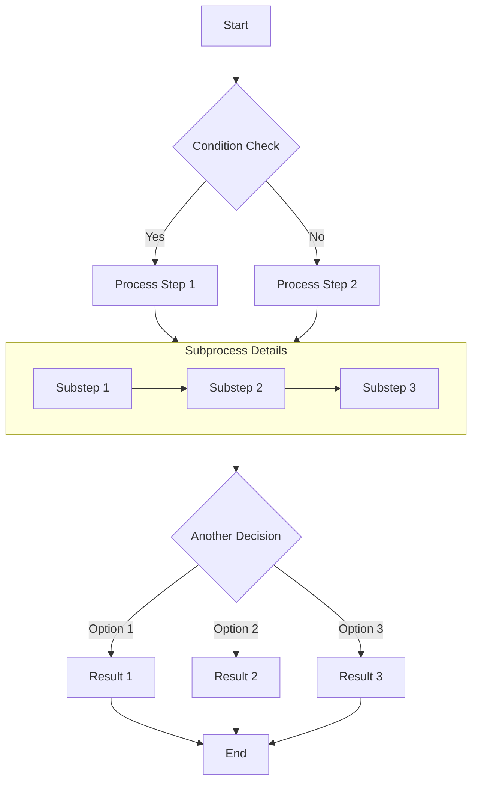
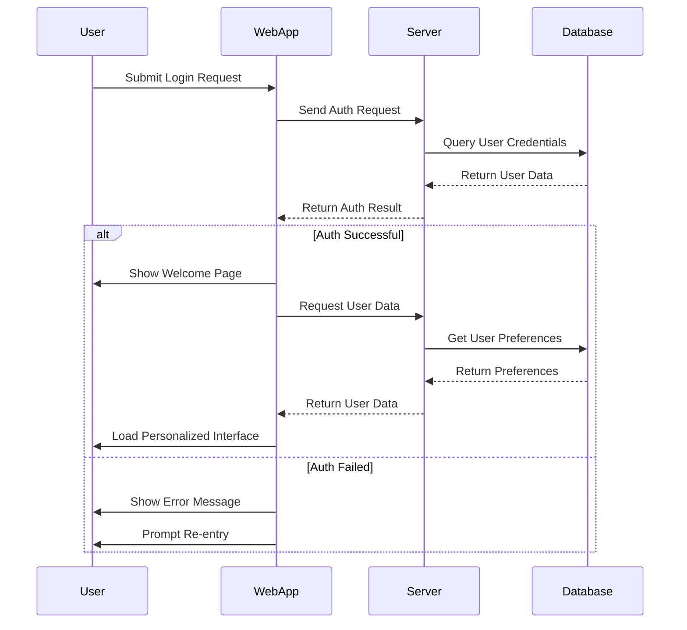
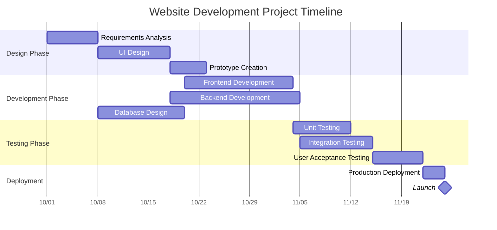
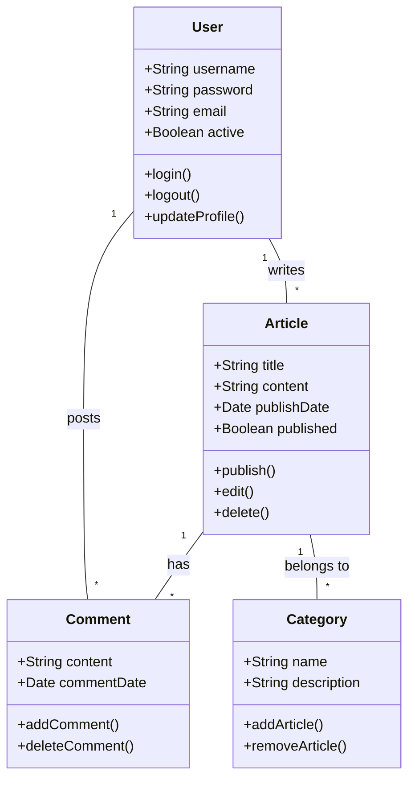
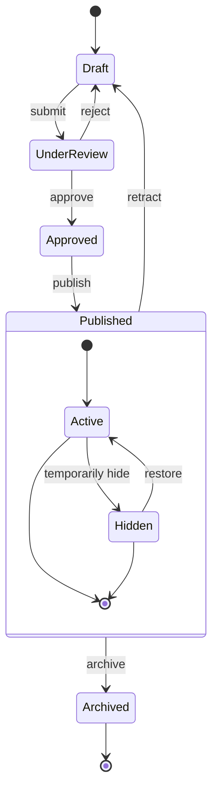
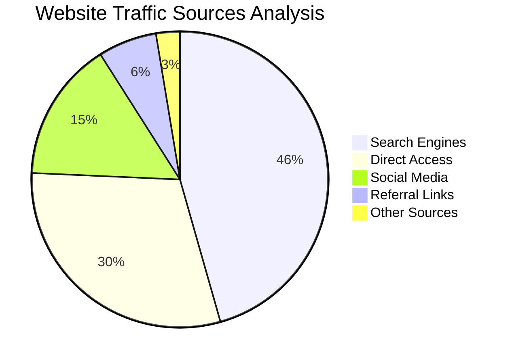

# [Frontmatter字段详解](https://docs.mizuki.mysqil.com/press/file/#frontmatter字段详解)

frontmatter支持的字段包括：

### [必需字段](https://docs.mizuki.mysqil.com/press/file/#必需字段)

- `title`：文章标题（必需）
- `description`：文章描述（必需）

### [发布相关](https://docs.mizuki.mysqil.com/press/file/#发布相关)

- `published`：文章发布日期，格式为YYYY-MM-DD
- `pubDate`：文章发布日期（与published类似）
- `date`：文章创建日期
- `draft`：是否为草稿，true表示草稿，false表示正式发布

### [内容分类](https://docs.mizuki.mysqil.com/press/file/#内容分类)

- `tags`：文章标签数组，用于标记文章主题
- `category`：文章分类，用于组织文章
- `pinned`：是否置顶文章，true表示置顶

### [作者信息](https://docs.mizuki.mysqil.com/press/file/#作者信息)

- `author`：文章作者姓名
- `licenseName`：文章许可证名称，如"MIT"、"CC BY 4.0"等
- `sourceLink`：文章源链接，通常指向GitHub仓库或原始来源

### [图片设置](https://docs.mizuki.mysqil.com/press/file/#图片设置)

- ```
  image
  ```

  ：文章封面图片(单文件方案会导致RSS无法正常构建图片的路径,如果你需要使用rss功能请使用文件夹写作方案)

  - `url`：图片URL地址
  - `alt`：图片替代文本

1. 在frontmatter下方编写文章内容，可以使用标准的Markdown语法。

   # 实例

   ```
   ---
   title: Markdown Tutorial
   published: 2025-01-20
   pinned: true
   description: A simple example of a Markdown blog post.
   tags: [Markdown, Blogging]
   category: Examples
   licenseName: "Unlicensed"
   author: emn178
   sourceLink: "https://github.com/emn178/markdown"
   draft: false
   date: 2025-01-20
   image:
     url: 'https://example.com/image.jpg'
     alt: '图片描述'
   pubDate: 2025-01-20
   ---
   ```

   # 教程整合
   
   # 1.Video
   
   Just copy the embed code from YouTube or other platforms, and paste it in the markdown file.
   
   ```yaml
   ---
   title: Include Video in the Post
   published: 2023-10-19
   // ...
   ---
   
   <iframe width="100%" height="468" src="https://www.youtube.com/embed/5gIf0_xpFPI?si=N1WTorLKL0uwLsU_" title="YouTube video player" frameborder="0" allowfullscreen></iframe>
   ```
   
   ## YouTube
   
   <iframe width="100%" height="468" src="https://www.youtube.com/embed/5gIf0_xpFPI?si=N1WTorLKL0uwLsU_" title="YouTube video player" frameborder="0" allow="accelerometer; autoplay; clipboard-write; encrypted-media; gyroscope; picture-in-picture; web-share" allowfullscreen></iframe>
   
   ## Bilibili
   
   <iframe width="100%" height="468" src="//player.bilibili.com/player.html?bvid=BV1fK4y1s7Qf&p=1&autoplay=0" scrolling="no" border="0" frameborder="no" framespacing="0" allowfullscreen="true" &autoplay=0> </iframe>

# 2.Markdown Tutorial

A markdown example shows how to write a markdown file. This document integrates core syntax and extensions (GMF).

- [Block Elements](#block-elements)
  - [Paragraphs and Line Breaks](#paragraphs-and-line-breaks)
  - [Headers](#headers)
  - [Blockquotes](#blockquotes)
  - [Lists](#lists)
  - [Code Blocks](#code-blocks)
  - [Horizontal Rules](#horizontal-rules)
  - [Table](#table)
- [Span Elements](#span-elements)
  - [Links](#links)
  - [Emphasis](#emphasis)
  - [Code](#code)
  - [Images](#images)
  - [Strikethrough](#strikethrough)
- [Miscellaneous](#miscellaneous)
  - [Automatic Links](#automatic-links)
  - [Backslash Escapes](#backslash-escapes)
- [Inline HTML](#inline-html)

## Block Elements

### Paragraphs and Line Breaks

#### Paragraphs

HTML Tag: `<p>`

One or more blank lines. (A blank line is a line containing nothing but **spaces** or **tabs** is considered blank.)

Code:

    This will be
    inline.
    
    This is second paragraph.

Preview:

---

This will be
inline.

This is second paragraph.

---

#### Line Breaks

HTML Tag: `<br />`

End a line with **two or more spaces**.

Code:

    This will be not
    inline.

Preview:

---

This will be not  
inline.

---

### Headers

Markdown supports two styles of headers, Setext and atx.

#### Setext

HTML Tags: `<h1>`, `<h2>`

"Underlined" using **equal signs (=)** as `<h1>` and **dashes (-)** as `<h2>` in any number.

Code:

    This is an H1
    =============
    This is an H2
    -------------

Preview:

## This is an H1

## This is an H2

---

#### atx

HTML Tags: `<h1>`, `<h2>`, `<h3>`, `<h4>`, `<h5>`, `<h6>`

Uses 1-6 **hash characters (#)** at the start of the line, corresponding to `<h1>` - `<h6>`.

Code:

    # This is an H1
    ## This is an H2
    ###### This is an H6

Preview:

## This is an H1

## This is an H2

###### This is an H6

---

Optionally, you may "close" atx-style headers. The closing hashes **don't need to match** the number of hashes used to open the header.

Code:

    # This is an H1 #
    ## This is an H2 ##
    ### This is an H3 ######

Preview:

## This is an H1

## This is an H2

### This is an H3

---

### Blockquotes

HTML Tag: `<blockquote>`

Markdown uses email-style **>** characters for blockquoting. It looks best if you hard wrap the text and put a > before every line.

Code:

    > This is a blockquote with two paragraphs. Lorem ipsum dolor sit amet,
    > consectetuer adipiscing elit. Aliquam hendrerit mi posuere lectus.
    > Vestibulum enim wisi, viverra nec, fringilla in, laoreet vitae, risus.
    >
    > Donec sit amet nisl. Aliquam semper ipsum sit amet velit. Suspendisse
    > id sem consectetuer libero luctus adipiscing.

Preview:

---

> This is a blockquote with two paragraphs. Lorem ipsum dolor sit amet,
> consectetuer adipiscing elit. Aliquam hendrerit mi posuere lectus.
> Vestibulum enim wisi, viverra nec, fringilla in, laoreet vitae, risus.
>
> Donec sit amet nisl. Aliquam semper ipsum sit amet velit. Suspendisse
> id sem consectetuer libero luctus adipiscing.

---

Markdown allows you to be lazy and only put the > before the first line of a hard-wrapped paragraph.

Code:

    > This is a blockquote with two paragraphs. Lorem ipsum dolor sit amet,
    consectetuer adipiscing elit. Aliquam hendrerit mi posuere lectus.
    Vestibulum enim wisi, viverra nec, fringilla in, laoreet vitae, risus.
    
    > Donec sit amet nisl. Aliquam semper ipsum sit amet velit. Suspendisse
    id sem consectetuer libero luctus adipiscing.

Preview:

---

> This is a blockquote with two paragraphs. Lorem ipsum dolor sit amet,
> consectetuer adipiscing elit. Aliquam hendrerit mi posuere lectus.
> Vestibulum enim wisi, viverra nec, fringilla in, laoreet vitae, risus.

> Donec sit amet nisl. Aliquam semper ipsum sit amet velit. Suspendisse
> id sem consectetuer libero luctus adipiscing.

---

Blockquotes can be nested (i.e. a blockquote-in-a-blockquote) by adding additional levels of >.

Code:

    > This is the first level of quoting.
    >
    > > This is nested blockquote.
    >
    > Back to the first level.

Preview:

---

> This is the first level of quoting.
>
> > This is nested blockquote.
>
> Back to the first level.

---

Blockquotes can contain other Markdown elements, including headers, lists, and code blocks.

Code:

    > ## This is a header.
    >
    > 1.   This is the first list item.
    > 2.   This is the second list item.
    >
    > Here's some example code:
    >
    >     return shell_exec("echo $input | $markdown_script");

Preview:

---

> ## This is a header.
>
> 1.  This is the first list item.
> 2.  This is the second list item.
>
> Here's some example code:
>
>     return shell_exec("echo $input | $markdown_script");

---

### Lists

Markdown supports ordered (numbered) and unordered (bulleted) lists.

#### Unordered

HTML Tag: `<ul>`

Unordered lists use **asterisks (\*)**, **pluses (+)**, and **hyphens (-)**.

Code:

    *   Red
    *   Green
    *   Blue

Preview:

---

- Red
- Green
- Blue

---

is equivalent to:

Code:

    +   Red
    +   Green
    +   Blue

and:

Code:

    -   Red
    -   Green
    -   Blue

#### Ordered

HTML Tag: `<ol>`

Ordered lists use numbers followed by periods:

Code:

    1.  Bird
    2.  McHale
    3.  Parish

Preview:

---

1.  Bird
2.  McHale
3.  Parish

---

It's possible to trigger an ordered list by accident, by writing something like this:

Code:

    1986. What a great season.

Preview:

---

1986. What a great season.

---

You can **backslash-escape (\\)** the period:

Code:

    1986\. What a great season.

Preview:

---

1986\. What a great season.

---

#### Indented

##### Blockquote

To put a blockquote within a list item, the blockquote's > delimiters need to be indented:

Code:

    *   A list item with a blockquote:
    
        > This is a blockquote
        > inside a list item.

Preview:

---

- A list item with a blockquote:

  > This is a blockquote
  > inside a list item.

---

##### Code Block

To put a code block within a list item, the code block needs to be indented twice — **8 spaces** or **two tabs**:

Code:

    *   A list item with a code block:
    
            <code goes here>

Preview:

---

- A list item with a code block:

      <code goes here>

---

##### Nested List

Code:

    * A
      * A1
      * A2
    * B
    * C

Preview:

---

- A
  - A1
  - A2
- B
- C

---

### Code Blocks

HTML Tag: `<pre>`

Indent every line of the block by at least **4 spaces** or **1 tab**.

Code:

    This is a normal paragraph:
    
        This is a code block.

Preview:

---

This is a normal paragraph:

    This is a code block.

---

A code block continues until it reaches a line that is not indented (or the end of the article).

Within a code block, **_ampersands (&)_** and angle **brackets (< and >)** are automatically converted into HTML entities.

Code:

        <div class="footer">
            &copy; 2004 Foo Corporation
        </div>

Preview:

---

    <div class="footer">
        &copy; 2004 Foo Corporation
    </div>

---

Following sections Fenced Code Blocks and Syntax Highlighting are extensions, you can use the other way to write the code block.

#### Fenced Code Blocks

Just wrap your code in ` ``` ` (as shown below) and you won't need to indent it by four spaces.

Code:

    Here's an example:
    
    ```
    function test() {
      console.log("notice the blank line before this function?");
    }
    ```

Preview:

---

Here's an example:

```
function test() {
  console.log("notice the blank line before this function?");
}
```

---

#### Syntax Highlighting

In your fenced block, add an optional language identifier and we'll run it through syntax highlighting ([Support Languages](https://github.com/github/linguist/blob/master/lib/linguist/languages.yml)).

Code:

    ```ruby
    require 'redcarpet'
    markdown = Redcarpet.new("Hello World!")
    puts markdown.to_html
    ```

Preview:

---

```ruby
require 'redcarpet'
markdown = Redcarpet.new("Hello World!")
puts markdown.to_html
```

---

### Horizontal Rules

HTML Tag: `<hr />`
Places **three or more hyphens (-), asterisks (\*), or underscores (\_)** on a line by themselves. You may use spaces between the hyphens or asterisks.

Code:

    * * *
    ***
    *****
    - - -
    ---------------------------------------
    ___

Preview:

---

---

---

---

---

---

---

---

### Table

HTML Tag: `<table>`

It's an extension.

Separates column by **pipe (|)** and header by **dashes (-)**, and uses **colon (:)** for alignment.

The outer **pipes (|)** and alignment are optional. There are **3 delimiters** each cell at least for separating header.

Code:

```
| Left | Center | Right |
|:-----|:------:|------:|
|aaa   |bbb     |ccc    |
|ddd   |eee     |fff    |

 A | B
---|---
123|456


A |B
--|--
12|45
```

Preview:

---

| Left | Center | Right |
| :--- | :----: | ----: |
| aaa  |  bbb   |   ccc |
| ddd  |  eee   |   fff |

| A    | B    |
| ---- | ---- |
| 123  | 456  |

| A    | B    |
| ---- | ---- |
| 12   | 45   |

---

## Span Elements

### Links

HTML Tag: `<a>`

Markdown supports two style of links: inline and reference.

#### Inline

Inline link format like this: `[Link Text](URL "Title")`

Title is optional.

Code:

    This is [an example](http://example.com/ "Title") inline link.
    
    [This link](http://example.net/) has no title attribute.

Preview:

---

This is [an example](http://example.com/ "Title") inline link.

[This link](http://example.net/) has no title attribute.

---

If you're referring to a local resource on the same server, you can use relative paths:

Code:

    See my [About](/about/) page for details.

Preview:

---

See my [About](/about/) page for details.

---

#### Reference

You could predefine link references. Format like this: `[id]: URL "Title"`

Title is also optional. And the you refer the link, format like this: `[Link Text][id]`

Code:

    [id]: http://example.com/  "Optional Title Here"
    This is [an example][id] reference-style link.

Preview:

---

[id]: http://example.com/ "Optional Title Here"

This is [an example][id] reference-style link.

---

That is:

- Square brackets containing the link identifier (**not case sensitive**, optionally indented from the left margin using up to three spaces);
- followed by a colon;
- followed by one or more spaces (or tabs);
- followed by the URL for the link;
- The link URL may, optionally, be surrounded by angle brackets.
- optionally followed by a title attribute for the link, enclosed in double or single quotes, or enclosed in parentheses.

The following three link definitions are equivalent:

Code:

    [foo]: http://example.com/  "Optional Title Here"
    [foo]: http://example.com/  'Optional Title Here'
    [foo]: http://example.com/  (Optional Title Here)
    [foo]: <http://example.com/>  "Optional Title Here"

Uses an empty set of square brackets, the link text itself is used as the name.

Code:

    [Google]: http://google.com/
    [Google][]

Preview:

---

[Google]: http://google.com/

[Google][]

---

### Emphasis

HTML Tags: `<em>`, `<strong>`

Markdown treats **asterisks (\*)** and **underscores (\_)** as indicators of emphasis. **One delimiter** will be `<em>`; \*_double delimiters_ will be `<strong>`.

Code:

    *single asterisks*
    
    _single underscores_
    
    **double asterisks**
    
    __double underscores__

Preview:

---

_single asterisks_

_single underscores_

**double asterisks**

**double underscores**

---

But if you surround an \* or \_ with spaces, it'll be treated as a literal asterisk or underscore.

You can backslash escape it:

Code:

    \*this text is surrounded by literal asterisks\*

Preview:

---

\*this text is surrounded by literal asterisks\*

---

### Code

HTML Tag: `<code>`

Wraps it with **backtick quotes (`)**.

Code:

    Use the `printf()` function.

Preview:

---

Use the `printf()` function.

---

To include a literal backtick character within a code span, you can use **multiple backticks** as the opening and closing delimiters:

Code:

    ``There is a literal backtick (`) here.``

Preview:

---

``There is a literal backtick (`) here.``

---

The backtick delimiters surrounding a code span may include spaces — one after the opening, one before the closing. This allows you to place literal backtick characters at the beginning or end of a code span:

Code:

    A single backtick in a code span: `` ` ``
    
    A backtick-delimited string in a code span: `` `foo` ``

Preview:

---

A single backtick in a code span: `` ` ``

A backtick-delimited string in a code span: `` `foo` ``

---

### Images

HTML Tag: ``

Markdown uses an image syntax that is intended to resemble the syntax for links, allowing for two styles: inline and reference.

#### Inline

Inline image syntax looks like this: ``

Title is optional.

Code:

    
    
    

Preview:

---


---

That is:

- An exclamation mark: !;
- followed by a set of square brackets, containing the alt attribute text for the image;
- followed by a set of parentheses, containing the URL or path to the image, and an optional title attribute enclosed in double or single quotes.

#### Reference

Reference-style image syntax looks like this: `![Alt text][id]`

Code:

    [img id]: https://s2.loli.net/2024/08/20/5fszgXeOxmL3Wdv.webp  "Optional title attribute"
    ![Alt text][img id]

Preview:

---

[img id]: https://s2.loli.net/2024/08/20/5fszgXeOxmL3Wdv.webp "Optional title attribute"

![Alt text][img id]

---

### Strikethrough

HTML Tag: `<del>`

It's an extension.

GFM adds syntax to strikethrough text.

Code:

```
~~Mistaken text.~~
```

Preview:

---

~~Mistaken text.~~

---

## Miscellaneous

### Automatic Links

Markdown supports a shortcut style for creating "automatic" links for URLs and email addresses: simply surround the URL or email address with angle brackets.

Code:

    <http://example.com/>
    
    <address@example.com>

Preview:

---

<http://example.com/>

<address@example.com>

---

GFM will autolink standard URLs.

Code:

```
https://github.com/emn178/markdown
```

Preview:

---

https://github.com/emn178/markdown

---

### Backslash Escapes

Markdown allows you to use backslash escapes to generate literal characters which would otherwise have special meaning in Markdown's formatting syntax.

Code:

    \*literal asterisks\*

Preview:

---

\*literal asterisks\*

---

Markdown provides backslash escapes for the following characters:

Code:

    \   backslash
    `   backtick
    *   asterisk
    _   underscore
    {}  curly braces
    []  square brackets
    ()  parentheses
    #   hash mark
    +   plus sign
    -   minus sign (hyphen)
    .   dot
    !   exclamation mark

## Inline HTML

For any markup that is not covered by Markdown's syntax, you simply use HTML itself. There's no need to preface it or delimit it to indicate that you're switching from Markdown to HTML; you just use the tags.

Code:

    This is a regular paragraph.
    
    <table>
        <tr>
            <td>Foo</td>
        </tr>
    </table>
    
    This is another regular paragraph.

Preview:

---

This is a regular paragraph.

<table>
    <tr>
        <td>Foo</td>
    </tr>
</table>


This is another regular paragraph.

---

Note that Markdown formatting syntax is **not processed within block-level HTML tags**.

Unlike block-level HTML tags, Markdown syntax is **processed within span-level tags**.

Code:

    <span>**Work**</span>
    
    <div>
        **No Work**
    </div>

Preview:

---

<span>**Work**</span>

<div>
  **No Work**
</div>

***

# 3.markdown-mermaid

## Complete Guide to Markdown with Mermaid Diagrams

This article demonstrates how to create various complex diagrams using Mermaid in Markdown documents, including flowcharts, sequence diagrams, Gantt charts, class diagrams, and state diagrams.

## Flowchart Example

Flowcharts are excellent for representing processes or algorithm steps.




## Sequence Diagram Example

Sequence diagrams show interactions between objects over time.



## Gantt Chart Example

Gantt charts are perfect for displaying project schedules and timelines.



## Class Diagram Example

Class diagrams show the static structure of a system, including classes, attributes, methods, and their relationships.



## State Diagram Example

State diagrams show the sequence of states an object goes through during its life cycle.



## Pie Chart Example

Pie charts are ideal for displaying proportions and percentage data.



## Conclusion

Mermaid is a powerful tool for creating various types of diagrams in Markdown documents. This article demonstrated how to use flowcharts, sequence diagrams, Gantt charts, class diagrams, state diagrams, and pie charts. These diagrams can help you express complex concepts, processes, and data structures more clearly.

To use Mermaid, simply specify the mermaid language in a code block and describe the diagram using concise text syntax. Mermaid will automatically convert these descriptions into beautiful visual diagrams.

Try using Mermaid diagrams in your next technical blog post or project documentation - they will make your content more professional and easier to understand!

# 4.markdown-extended

## GitHub Repository Cards

You can add dynamic cards that link to GitHub repositories, on page load, the repository information is pulled from the GitHub API. 

::github{repo="matsuzaka-yuki/Mizuki"}

Create a GitHub repository card with the code `::github{repo="matsuzaka-yuki/Mizuki"}`.

```markdown
::github{repo="matsuzaka-yuki/Mizuki"}
```

## Admonitions

Following types of admonitions are supported: `note` `tip` `important` `warning` `caution`

:::note
Highlights information that users should take into account, even when skimming.
:::

:::tip
Optional information to help a user be more successful.
:::

:::important
Crucial information necessary for users to succeed.
:::

:::warning
Critical content demanding immediate user attention due to potential risks.
:::

:::caution
Negative potential consequences of an action.
:::

### Basic Syntax

```markdown
:::note
Highlights information that users should take into account, even when skimming.
:::

:::tip
Optional information to help a user be more successful.
:::
```

### Custom Titles

The title of the admonition can be customized.

:::note[MY CUSTOM TITLE]
This is a note with a custom title.
:::

```markdown
:::note[MY CUSTOM TITLE]
This is a note with a custom title.
:::
```

### GitHub Syntax

> [!TIP]
> [The GitHub syntax](https://github.com/orgs/community/discussions/16925) is also supported.

```
> [!NOTE]
> The GitHub syntax is also supported.

> [!TIP]
> The GitHub syntax is also supported.
```

### Spoiler

You can add spoilers to your text. The text also supports **Markdown** syntax.

The content :spoiler[is hidden **ayyy**]!

```markdown
The content :spoiler[is hidden **ayyy**]!

```


# 5.encrypted-post

This blog template is built with [Astro](https://astro.build/). For the things that are not mentioned in this guide, you may find the answers in the [Astro Docs](https://docs.astro.build/).

## Front-matter of Posts

```yaml
---
title: My First Blog Post
published: 2023-09-09
description: This is the first post of my new Astro blog.
image: ./cover.jpg
tags: [Foo, Bar]
category: Front-end
draft: false
---
```


| Attribute     | Description                                                  |
| ------------- | ------------------------------------------------------------ |
| `title`       | The title of the post.                                       |
| `published`   | The date the post was published.                             |
| `pinned`      | Whether this post is pinned to the top of the post list.     |
| `description` | A short description of the post. Displayed on index page.    |
| `image`       | The cover image path of the post.<br/>1. Start with `http://` or `https://`: Use web image<br/>2. Start with `/`: For image in `public` dir<br/>3. With none of the prefixes: Relative to the markdown file |
| `tags`        | The tags of the post.                                        |
| `category`    | The category of the post.                                    |
| `licenseName` | The license name for the post content.                       |
| `author`      | The author of the post.                                      |
| `sourceLink`  | The source link or reference for the post content.           |
| `draft`       | If this post is still a draft, which won't be displayed.     |

## Where to Place the Post Files


Your post files should be placed in `src/content/posts/` directory. You can also create sub-directories to better organize your posts and assets.

```
src/content/posts/
├── post-1.md
└── post-2/
    ├── cover.png
    └── index.md
```

# 6.draft

## This Article is a Draft

This article is currently in a draft state and is not published. Therefore, it will not be visible to the general audience. The content is still a work in progress and may require further editing and review.

When the article is ready for publication, you can update the "draft" field to "false" in the Frontmatter:

```markdown
---
title: Draft Example
published: 2024-01-11T04:40:26.381Z
tags: [Markdown, Blogging, Demo]
category: Examples
draft: false
---

```


# 7.添加文章标题图片


This blog template is built with [Astro](https://astro.build/). For the things that are not mentioned in this guide, you may find the answers in the [Astro Docs](https://docs.astro.build/).

## Front-matter of Posts

```yaml
---
title: My First Blog Post
published: 2023-09-09
description: This is the first post of my new Astro blog.
image: ./cover.jpg
tags: [Foo, Bar]
category: Front-end
draft: false
---
```


| Attribute     | Description                                                  |
| ------------- | ------------------------------------------------------------ |
| `title`       | The title of the post.                                       |
| `published`   | The date the post was published.                             |
| `pinned`      | Whether this post is pinned to the top of the post list.     |
| `description` | A short description of the post. Displayed on index page.    |
| `image`       | The cover image path of the post.<br/>1. Start with `http://` or `https://`: Use web image<br/>2. Start with `/`: For image in `public` dir<br/>3. With none of the prefixes: Relative to the markdown file |
| `tags`        | The tags of the post.                                        |
| `category`    | The category of the post.                                    |
| `licenseName` | The license name for the post content.                       |
| `author`      | The author of the post.                                      |
| `sourceLink`  | The source link or reference for the post content.           |
| `draft`       | If this post is still a draft, which won't be displayed.     |

## Where to Place the Post Files


Your post files should be placed in `src/content/posts/` directory. You can also create sub-directories to better organize your posts and assets.

```
src/content/posts/
├── post-1.md
└── post-2/
    ├── cover.png
    └── index.md
```